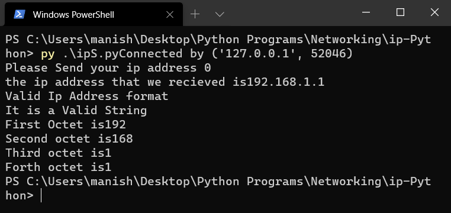
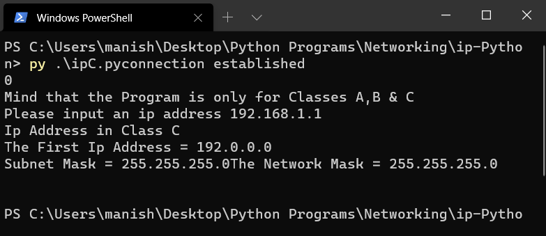

# Networking
This Repository contains Socket Programs in Python and C 

1. ## Simple Socket Program
    1. ### [Simple-Server.py](Simple-Socket-Programming-in-Python/Simple-Server.py)
        
    1. ### [Simple-Client.py](Simple-Socket-Programming-in-Python/Simple-Client.py)
        

1. ## ARQ Visualization Program
    1. ### [Server-ARQ.py](ARQ-with-NACK/Server-ARQ.py)
        
    1. ### [Client-ARQ.py](ARQ-with-NACK/Client-ARQ.py)
        

1. ## IP Address Question - Python
    #### Q. Determine the IP Address Class, Subnet Mask and First IP address of that Class
    1. ### [ipServer.py](ip-Python/ipS.py)
        
    1. ### [ipClient.py](ip-Python/ipC.py)
        
    1. ### [ipServer.c](ip-C/ipS.c)
    1. ### [ipClient.c](ip-C/ipC.c)